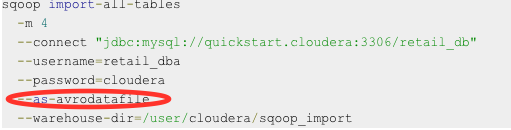
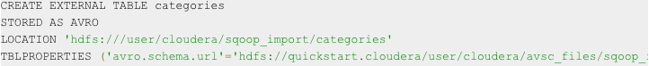

# Hive
Hive is a data warehouse system built on top of Hadoop. 

## Hive Metastore
* Remote: for production setting. 
* Local
* Embedded

## Hive CLI
* retrieve query explain plans
* view and manipulate table metadata
* perform queries, DML, and DDL
  - `hive -f` allows you to execute HiveQL that's saved in a text file
  
## Data Type
* Maps: M[k] where M is a map and k is a key value
* Arrays: A[n] where A is an array and n is an int
* Structs: S.x where S is a struct and x is the name of the field you wish to retrieve
* A subset of RDBMS primitive types

# Hive DDL
## Logical Data Structure
* Database -> 
* Table -> 
  - Managed table and external table
  - When delete managed table, the files in HDFS will be gone.
* Partition -> A virtual column which defines how data is stored on the file system based on its values. Each table can have one or more partitions (and one or more levels of partition). 
* Buckets(or Clusters) -> In each partition, data can be divided into buckets based on the hash value of a column in the table (useful for sampling, join optimization). 

## JOIN
* Left Semi-Join
* Inner Join
* Full Outer Join
* Equi-join

# Hive DML
## Data Manipulation between Local/HDFS and Hive
* Loading data from input file (Schema on Read)  
`LOAD DATA LOCAL INPATH '/tmp/data/users.dat' OVERWRITE INTO TABLE users;`
  - The "LOCAL" indicates the source data is on the local filesystem
  - Local data is **copied** to final location
  - Otherwise file is assumed to be on HDFS and is **moved** to final location
  - Hive does not do any trasformation while loading data into tables
* Loading data into a partition requires PARTITION clause  
`LOAD DATA LOCAL INPATH '/tmp/data/usersny.dat' OVERWRITE INTO TABLE users; PARTITION (country = 'US', state = 'NY')`
  - HDFS directory is created: `/user/hive/warehouse/mydb.db/users/country=US/state=NY`
  - userny.dat file is copied to this HDFS directory
* Export data from Hive to the local file system  
`INSERT OVERWRITE LOCAL DIRECTORY`

## Data Manipulation between Relational Database and Hive
Create a table in Hive metastore using Avro file format and an external schema file

### Generate Avro Files

### Create External Table

