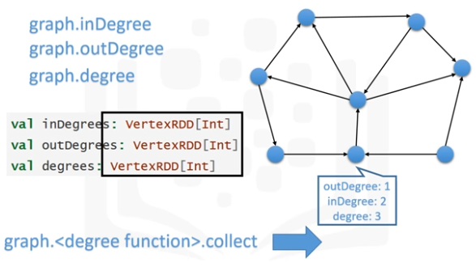
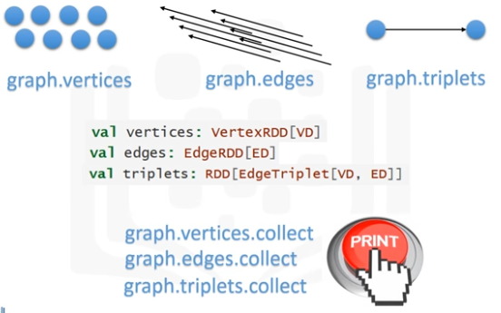

# GRAPH-PARALLEL
* Data-Parallel analylsis system, such as Hadoop and Spark, focuses on distributing data across different nodes and systems.
* Graph-Parallel system, such as Pregel, GraphLab and Giraph, focuses on efficiently executing graph algorithms.
* GraphX unifies Data-Parallelism and Graph-Parallelism in one library.

# Visualizing GraphX
* Other libraries such as Gephi or GraphLab can help GraphX with visualization.
* Creating a View with Triplet
  - srcAttr: Source Attribute
  - dstAttr: Destination Attribute
  - srcId: Source ID
  - dstId: Destination ID
  - attr: Edge Attribute
* GraphX Operators
  - numEdges, numVertices
  - inDegree, outDegree, degree  
  
  - Vertices, Edges and Triplets  
  
