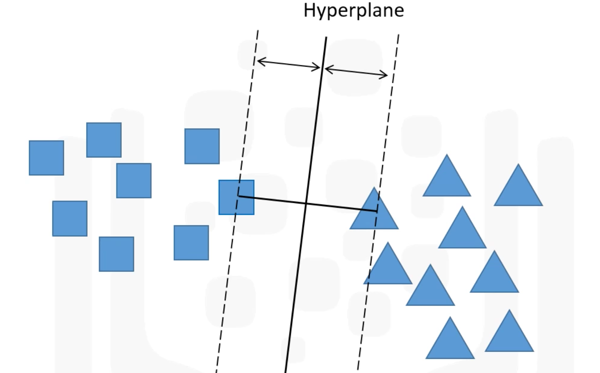
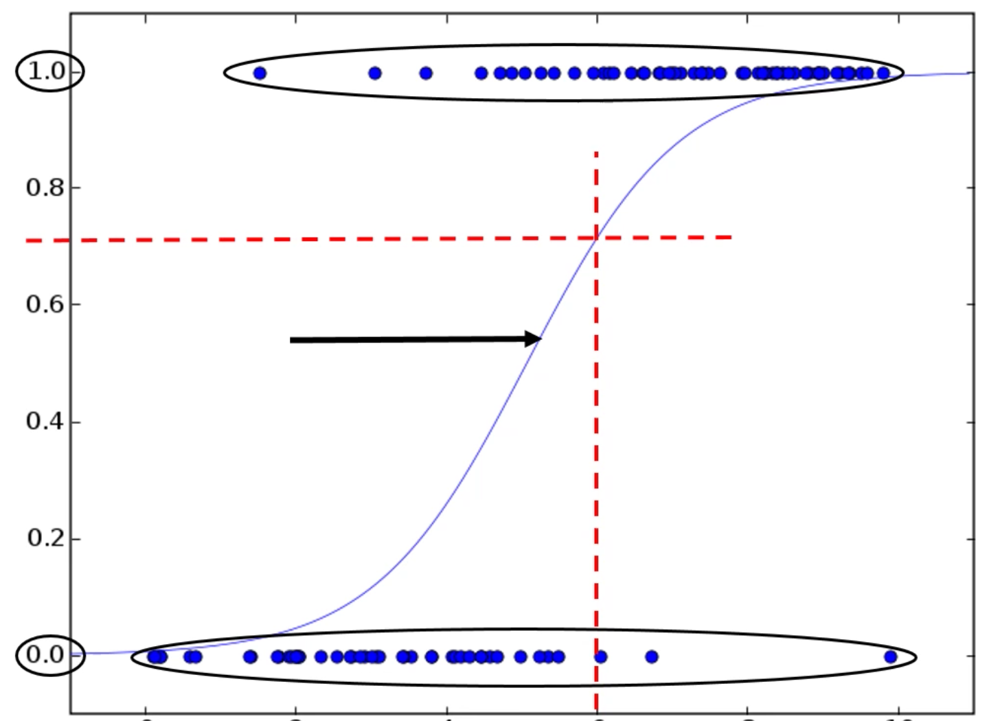

# Spark MLlib Data Types
## Local Vector
* Dense Vector 
  - NumPy Array and Python List are recognized as Dense Vectors. 
  - Generally, NumPy arrays are recommended over lists for efficiency. 
* Sparse Vector
  - A majority of the values in a sparse vector will be zeros. 
  - SciPy csc_matrix is recognized as Sparse Vector. 
  - Training data is commonly sparse. 

## Labeled Points

## Local Matrix
* Row Pointers/Column Pointers 
* Dense Matrix: Column-Major Ordering
* Sparse Matrix: Row-Major Ordering

## Distributed Matrix 
* RowMatrix
* IndexedRowMatrix
* CoordinateMatrix
* BlockMatrix
  - A MatrixBlock is a tuple with two inputs: `((blockRowIndex, BlockColIndex), Matrix)`

# Algorithms 
* Linear Regression: There are different evaluation methods that can be used
  - Mean Absolute Error (MAE)
  - Mean Square Error (MSE)
  - Root Mean Squared Error (RMSE)
* Support Vector Machines (SVM)

* Logistic Regression

* Decision Trees
* Random Forests
* K-Means Clustering
* Gaussian Mixture Clustering
