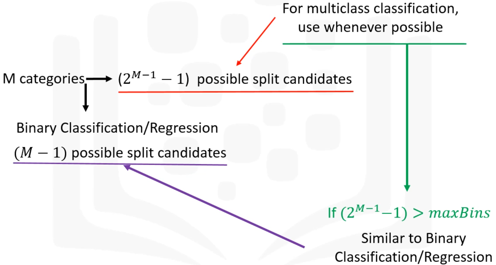
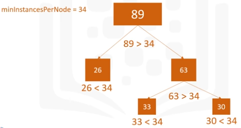
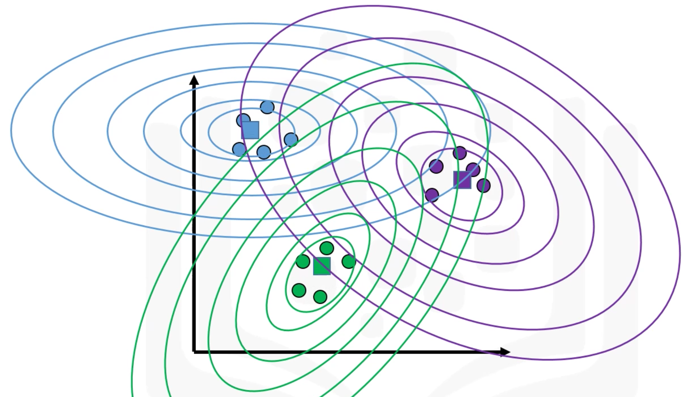

# Spark MLlib Data Types
## Local Vector
* Dense Vector 
  - NumPy Array and Python List are recognized as Dense Vectors. 
  - Generally, NumPy arrays are recommended over lists for efficiency. 
* Sparse Vector
  - A majority of the values in a sparse vector will be zeros. 
  - SciPy csc_matrix is recognized as Sparse Vector. 
  - Training data is commonly sparse. 

## Labeled Points

## Local Matrix
* Row Pointers/Column Pointers 
* Dense Matrix: Column-Major Ordering
* Sparse Matrix: Row-Major Ordering

## Distributed Matrix 
* RowMatrix
* IndexedRowMatrix
* CoordinateMatrix
* BlockMatrix
  - A MatrixBlock is a tuple with two inputs: `((blockRowIndex, BlockColIndex), Matrix)`

# Algorithms 
## Linear Regression: 
There are different evaluation methods that can be used
* Mean Absolute Error (MAE)
* Mean Square Error (MSE)
* Root Mean Squared Error (RMSE)
## Support Vector Machines (SVM)

## Logistic Regression

## Decision Trees
### The Types of Decision Trees Spark MLlib Supports
* Binary Classification Tree
* Multi-class Classification Tree
* Regression Decision Tree
### Parameters involved in Decision Tree splitting features
* Continuous Features
* Categorical Features
   
* Stop Functions (Stopping Rule): Recursion stops if any of the following conditions are met. 
  - Node depth is equal to the maxDepth training parameter.
  - No split candidate leads to information gain greater than minInfoGain. 
  - No split candidate produces child nodes which have at least minInstancesPerNode training instances. 
### Parameters involved in creating Decision Trees
* Specifiable Parameters (without Tuning required)
* Tunable Parameters
* Stopping Parameters (Tunable)
  - maxDepth = Maximum depth of the tree
  - minInstancesPerNode
    * Number of instances required for node to split further
    * Commonly used in RandomForest  
    
      
## Random Forests
## K-Means Clustering: Unsupervised Learning
## Gaussian Mixture Clustering

