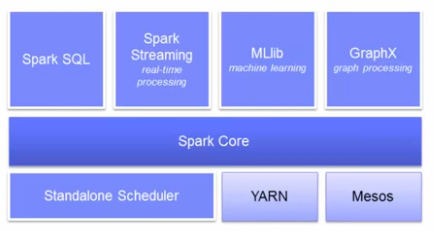

# Spark Unified Stack


# RDD (Resilient Distributed Datasets)
## Partitioners For Key/Value RDDs
* Adding a key to an RDD does not change the partitioning
* Pairs with same key may not be in same partition (**co-located**)
* Co-location beneficial for many operations
* We can partition records by their keys
* partitionBy causes a shuffle
* `coalesce` can reduce the number of partitions without causing a shuffle. 

### Partitioner Types
* RangePartitioner
* HashPartitioner
  - Ensures all pairs with the same key are co-located
  - Partition = Key % numPartitions
  
## Stage
Shuffle dependency defines a stage boundary. 
  
## Advanced RDD Operations
* Statistical operations on numerical RDDs
  - histogram, mean, stdev, sum, variance, max, min
  - stats() returns all of the statistic values
* mapPartitions, mapPartitionsWithIndex
  - Map by partition (many -> many) instead of single value/pair (one -> one)
  - Useful when map use function has a high overhead cost
    * e.g., connect to a database once per partition instead of for each record
* foreachPartition
  - Use for batching operations
* Approximate calculations
  - Get approximate results for very large data sets
  `def countApproxDistinct(relativeSD: Double = 0.05) : Long`
* fold(zeroValue)((acc,value) => acc)
  - Similar to reduce, but has initial "zeroed" accumulator
  - Functions use the accumulator and RDD element to update accumulator
* aggregate(zeroValue)(accumulate, combine)
  - Perform complex aggregations
  - Accumulate by partition then combine results
* countByValue  
  ```
  val text = sc.textFile("README.md")  
  val counts = text.flatMap(_.split(" ")).map((_, 1)).reduceByKey(_ + _).collectAsMap()  
  val counts = text.flatMap(_.split(" ")).countByValue()
  ```
  
* reduceByKey
* countByKey: is not designed to be used in production 
* groupByKey
  - Cause a shuffle of all valaues across the network, even if they are already co-located within a partition 
  - Group all values by key from all partitions into memory
  - Potential cause of OOM (out of memory) errors
  - Intuitive, but **avoid** using when possible
* aggregateByKey: splits the calculation into two steps. Only one pair per key, per partition is shuffled. 
* Lookup: return all values for specified key 
* mapValues
  - Tells Spark that the hashed keys will remain in their partitions and we can keep the same partitioner across operations. 
  - Map the values in a pair RDD without affecting the keys or partitions. 

## Caching and Serialization
### Storage Levels
* MEMORY_ONLY: default, `cache() == persist(StorageLvel.MEMORY_ONLY)`
* MEMORY_AND_DISK
* MEMORY_ONLY_SER
* MEMORY_AND_DISK_SER
* DISK_ONLY
* MEMORY_ONLY_2: Same as the levels above, but replicate on two cluster nodes. 
* MEMORY_AND_DISK_2

### Persistence
* Persisting to disk would allow us to reconstitute the RDD in the event a partition is lost, instead of recomputing all the expensive operations for the lost partitions. 
* Ideally we want to persist **after** any pruning, filtering, or other transformations needed for downstream processing.  

### Serialization
* Serialization has the added benefit of helping with garbage collection, as you’ll be storing 1 object versus many small objects for each record.
* The records of an RDD will be stored as one large byte array.
* Serialization helps by saving space that persisting RDDs occupy in memory.

# Spark Application Programming 
## Spark Context 
## Linking with Spark
### Linking with Spark - Scala
* Must have a compatible Scala version to write applications.
  - e.g. Spark 1.1.1 uses Scala 2.10
* To Write a Spark application, you need to add a Maven dependency on Spark. 

### Linking with Spark - Python
* Import some Spark classes: `from pyspark import SparkContext`

### Linking with Spark - Java 
* Add dependencies
* Import classes

## Initialzing Spark 
### Initializing Spark - Scala
### Initializing Spark - Python
### Initializing Spark - Java

# Spark Configuration
## Main Components of Spark Cluster
* Driver
* Cluster Manger
  - Standalone
  - Apache Mesos
  - Hadoop YARN
* Worker Nodes

## Main Locations for Spark Configuration
* SparkConf Object
* Environment variables: `conf/spark-env.sh`
* Logging: `log4j.properties`

## Three Ways of Setting Spark Properties
* Set application properties via the SparkConf Object  

  ```
  var conf = new SparkConf()
      .setMaster("local")
      .setAppName("CountingSheep")
      .set("spark.executor.memory", "1g")
  var sc = new SparkContext(conf)
  ```
* Dynamically setting Spark properties
  - Create s SparkContext with an empty conf  
    `var sc = new SparkContext(new SparkConf())`
  - Supply the configuration values during runtime  
    ```
    ./bin/spark-submit --name "My app" --master local[4] --conf spark.shuffle.spill=false 
      --conf "spark.executor.extraJavaOptions=-XX:+PrintGCDetails -XX:+PrintGCTimeStamps" myApp.jar
    ```
* Application Web UI: `http://<driver>:4040`

# Cited
Run IBM BigData University Spark-Zeppelin Docker Image  
`docker run -i --name bdu_spark2 -P -p 4040:4040 -p 4041:4041 -p 8080:8080 -p 8081:8081 bigdatauniversity/spark2:latest`
