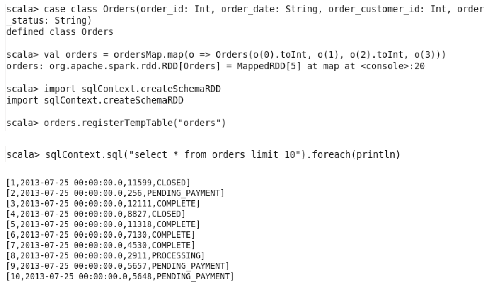

# Move data between HDFS and Spark
## Reading and Saving Text Files between HDFS and Spark
```
val dataRDD = sc.textFile("/user/cloudera/sqoop_import/departments")
dataRDD.collect.foreach(println)
dataRDD.saveAsTextFile("hdfs://quickstart.cloudera:8022/user/cloudera/spark/departments")
```
## Reading and Saving Hive Files between HDFS and Spark
```
import org.apache.spark.sql.hive.HiveContext
val sqlContext = new HiveContext(sc)
val depts = sqlContext.sql("select * from departments")
```
## Reading and Saving JSON Files between HDFS and Spark
```
import org.apache.spark.sql.SQLContext
val sqlContext = new SQLContext(sc)
val departmentsJson = sqlContext.jsonFile("/user/cloudera/scalaspark/departments.json")
```

# Word Count using Spark Scala


# Joining Disparate DataSets using Scala
The purpose of this example is to calculate totalRevenuePerDay

## Read Orders and OrderItems Datasets

## revenuePerOrderPerDay

## totalOrdersPerDay

## totalRevenuePerDay


# HiveContext and SQLContext
HiveContext is used when there are Hive tables; if not, we can use SQLContext to register temp tables. 

## SQLContext
### Load Data into RDD

### Register Temp Table

